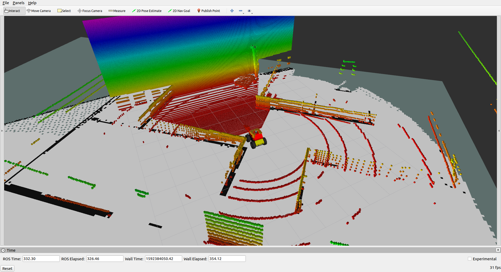

# Pointcloud merger
Package to combine 2 PointCloud2 in one with a target frame.




# Parameters
* ```target_frame``` Frame to merge the 2 clouds. Default ```base_link```
* ```cloud_out``` output topic name. Default ```cloud_out```
* ```cloud1``` input topic name. Default ```cloud1```
* ```cloud2``` input topic name. Default ```cloud2```
* ```transform_tolerance``` TF tolerance. Default ```1```
* ```concurrency_level``` Nodelet thread support. Default ```1```

# Features
* Nodelet support

# Known Issues
  Due to constant resize of PointCloud2, crash can occur.
  In that case,compile in debug mode '-DCMAKE_BUILD_TYPE=Debug', launch the debug launch file and create a merge request with test data (gdb knowledge required)

  ```roslaunch pointcloud_merger sample_node_debug.launch```

# Example Gazebo Robot
```roslaunch pointcloud_merger sample_node.launch```
